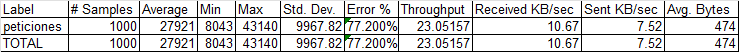
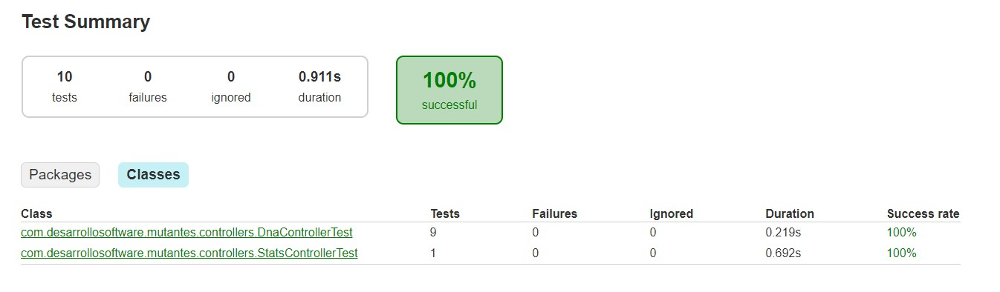

# Parcial Desarrollo de Software

---

### Desafío Mutantes Rest API


Rodrigo Vargas 47805 \
3k10

---

<div style="text-align: center;">
  
</div>

---

## Instrucciones

---

El API Rest se encuentra en https://parcial-mutantes-zxfw.onrender.com/

Podemos ejecutar dos tipos de request:

- **POST /mutant** para analizar la secuencia de ADN,
el POST debe ser un json que tenga el siguiente formato:

```
{
  "dna": [
    "XXXX",
    "XXXX",
    "XXXX",
    "XXXX"
  ]
}
```
La matriz debe cumplir los siguientes parámetros para que sea correcta y la acepte:

    - Solo puede contener los caracteres encontrados en una secuencia de ADN (A,C,G,T).
    - Debe ser una matriz de nxn, el mismo número de filas que de columnas.
    - No puede ser nulo, contener elementos nulos, o ser un array vacío.

Si no se cumple alguno de estos puntos recibiremos una respuesta **400 BAD REQUEST**,
indicando que hay algo mal en la matriz.

Si el POST es correcto, se enviará al sistema el cual analizará si el ADN corresponde a un mutante o a un humano.
Obtendremos las siguientes respuestas dependiendo del caso:
- 200-OK si es un ADN mutante.

- 403-FORBIDDEN si es un ADN no mutante.

El otro tipo de request que podemos ejecutar es:
- **GET /stats** en donde obtendremos un response 200-OK con las estadísticas acerca de 
cuántos ADN corresponden a mutantes y cuántos a no mutantes, y un ratio entre estos dos.

##  Pruebas con JMeter

---

Realizando un test con JMeter de 1000 peticiones de una sola vez al servidor de 
Render (https://parcial-mutantes-zxfw.onrender.com/) estos son los resultados obtenidos.



## Pruebas unitarias y Test coverage

---

Para ejecutar las pruebas 

Pruebas unitarias realizadas:

- Enviar un ADN vacío esperando un BadRequest
- Enviar un ADN nxm esperando un BadRequest
- Enviar un ADN con números esperando un BadRequest
- Enviar un ADN nulo esperando un BadRequest
- Enviar un ADN con elementos nulos esperando un BadRequest
- Enviar un ADN con una letra inválida esperando un BadRequest
- Solicitar los datos de /stats sin ingresar ningún ADN esperando todos los campos en 0
- Enviar un ADN mutante esperando 200-OK
- Enviar un ADN no mutante esperando 403-FORBIDDEN
- Enviar un ADN mutante de mayor tamaño esperando 200-OK



Todas estas pruebas dan el siguiente Test coverage


## Diagrama de Secuencia

---


